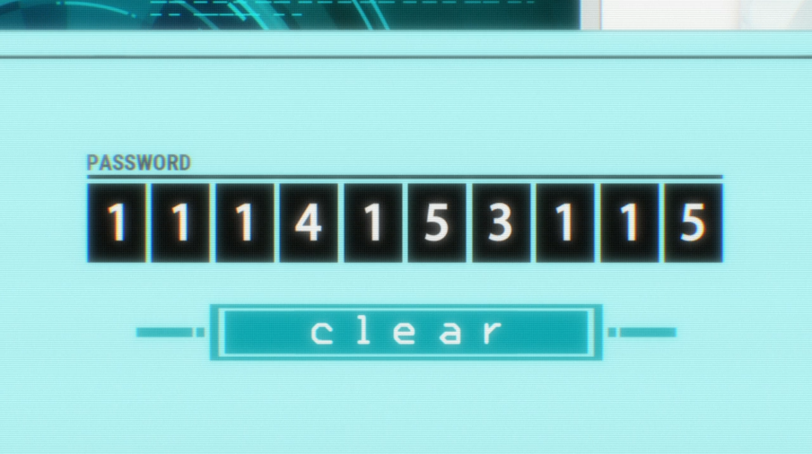

# Polybius Square

Quick implementation of decoding a polybius square.  

|x|1|2|3|4|5
|---|---|---|---|---|---
|**1**|A|B|C|D|E|
|**2**|F|G|H|I/J|K
|**3**|L|M|N|O|P|
|**4**|Q|R|S|T|U|
|**5**|V|W|X|Y|Z|

Used in Psycho Pass Season 3  

  

# How to Run

`npm i`  
`tsc polybius.ts`  
`node polybius.js`   